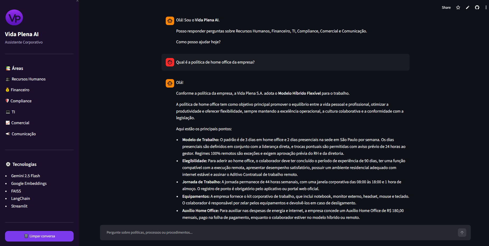

<h1 align="center">🤖 Vida Plena AI</h1>

<p align="center">
  <strong>Assistente Corporativo Inteligente utilizando RAG, Google Gemini e Streamlit</strong>
</p>

<p align="center">
  Desenvolvido para responder dúvidas de colaboradores utilizando exclusivamente a documentação interna da empresa.
</p>

<p align="center">
  
  
  
  
  
</p>

<p align="center">
  
</p>

<p align="center">
  <a href="https://vida-plena-ai-ejmn9mqyvpeawwthaqh8kr.streamlit.app">
    🌐 Acessar Aplicação
  </a>
  •
  <a href="https://github.com/yasmimfp/vida-plena-ai">
    📂 Repositório GitHub
  </a>
</p>

---

## 📖 Sobre o Projeto

O **Vida Plena AI** é um assistente corporativo baseado na arquitetura **Retrieval-Augmented Generation (RAG)**.

A aplicação permite que colaboradores consultem documentos internos da empresa por meio de uma conversa em linguagem natural.

Antes de responder qualquer pergunta, o sistema realiza uma busca semântica utilizando **FAISS**, recupera os documentos mais relevantes e envia essas informações como contexto para o **Google Gemini 2.5 Flash**, garantindo respostas fundamentadas exclusivamente na documentação disponível.

Essa abordagem reduz significativamente a geração de respostas incorretas (alucinações) e torna a aplicação mais confiável.

---

## 🚀 Como Funciona

O fluxo da aplicação segue a arquitetura **RAG (Retrieval-Augmented Generation)**:

1. O usuário envia uma pergunta.
2. A pergunta é transformada em embeddings.
3. O FAISS pesquisa os documentos mais relevantes.
4. Os trechos encontrados são enviados ao Google Gemini.
5. O modelo gera uma resposta baseada exclusivamente na documentação recuperada.

---

## ✨ Funcionalidades

- 💬 Chat corporativo em linguagem natural
- 📚 Busca semântica utilizando FAISS
- 🧠 Respostas utilizando Google Gemini 2.5 Flash
- 📄 Recuperação inteligente de documentos (RAG)
- 🔒 Proteção da API Key com variáveis de ambiente
- 📝 Histórico de conversa
- 🎨 Interface moderna desenvolvida em Streamlit
- 📱 Compatível com desktop e dispositivos móveis

---

## 🎯 Principais Recursos

- Consulta inteligente à documentação corporativa
- Recuperação de contexto utilizando FAISS
- Integração com Google Gemini
- Respostas fundamentadas na documentação
- Interface moderna e intuitiva
- Código organizado e modular
- Deploy em Streamlit Community Cloud

---

## 🛠️ Tecnologias Utilizadas

| Tecnologia | Utilização |
|------------|------------|
| Python 3.13 | Linguagem principal |
| Streamlit | Interface Web |
| LangChain | Orquestração do RAG |
| Google Gemini 2.5 Flash | Modelo de linguagem |
| Google Generative AI Embeddings | Vetorização |
| FAISS | Banco Vetorial |
| python-dotenv | Variáveis de ambiente |

---

## 🏗️ Arquitetura

```text
                    Usuário
                       │
                       ▼
              Interface Streamlit
                       │
                       ▼
                  LangChain
                       │
                       ▼
             Busca Vetorial (FAISS)
                       │
                       ▼
        Documentação Corporativa
                       │
                       ▼
          Google Gemini 2.5 Flash
                       │
                       ▼
              Resposta ao Usuário
```

---

## 📁 Estrutura do Projeto

```text
vida-plena-ai/
│
├── app.py
├── chatbot.py
├── ingest.py
├── requirements.txt
├── README.md
├── .gitignore
├── .env
│
├── assets/
│   ├── app-preview.png
│   └── favicon.png
│
├── documentos/
│
└── vectorstore/
```

---

## ⚙️ Como Executar Localmente

### Clone o repositório

```bash
git clone https://github.com/yasmimfp/vida-plena-ai.git
```

### Entre na pasta

```bash
cd vida-plena-ai
```

### Crie um ambiente virtual

```bash
python -m venv venv
```

### Ative o ambiente

**Windows**

```bash
venv\Scripts\activate
```

**Linux / macOS**

```bash
source venv/bin/activate
```

### Instale as dependências

```bash
pip install -r requirements.txt
```

### Configure a API do Google Gemini

Crie um arquivo chamado `.env`

```env
GOOGLE_API_KEY=SUA_API_KEY
```

### Execute a aplicação

```bash
streamlit run app.py
```

---

## 🌐 Deploy

A aplicação está disponível no **Streamlit Community Cloud**.

**Acesse:**

👉 https://vida-plena-ai-ejmn9mqyvpeawwthaqh8kr.streamlit.app

---

## 🔒 Segurança

A chave da API do Google Gemini não é armazenada no código-fonte.

Durante o desenvolvimento local, ela é carregada através de um arquivo `.env`.

Em produção, a chave é configurada utilizando o recurso **Secrets** do Streamlit Community Cloud, garantindo que informações sensíveis permaneçam protegidas.

---

## 👩‍💻 Autora

<p align="center">

### Yasmim Furlanetto

<a href="https://github.com/yasmimfp">

</a>

<a href="https://www.linkedin.com/in/yasmimfurla/">

</a>

</p>

---

## 📄 Licença

Este projeto foi desenvolvido para fins educacionais e para demonstração de habilidades em Inteligência Artificial, Retrieval-Augmented Generation (RAG), Python, LangChain e Streamlit.

---

<p align="center">
⭐ Se este projeto foi útil para você, considere deixar uma estrela no repositório.
</p>

<p align="center">
Desenvolvido com ❤️ por <strong>Yasmim Furlanetto</strong>.
</p>